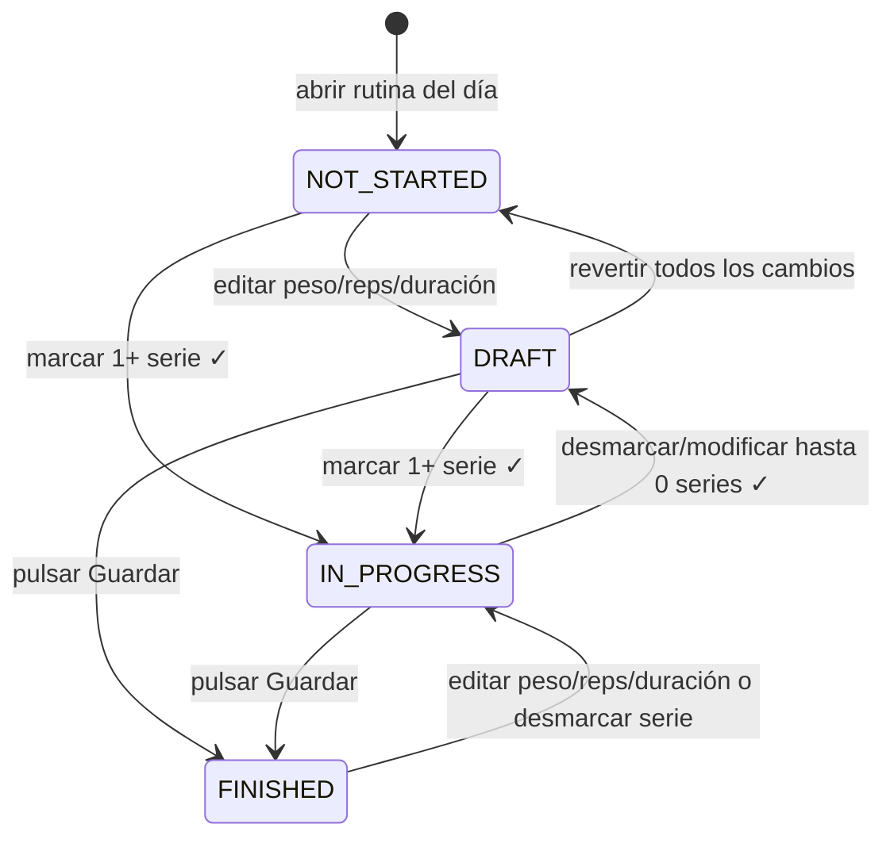

# GymRat Notes

PWA para registrar entrenamientos de gimnasio, rutinas semanales, progreso de cargas y medidas corporales. Funciona como app instalable y guarda los datos localmente en el navegador.

## Problema que resuelve

Permite llevar un diario de entrenamiento rápido desde móvil o desktop sin depender de hojas de cálculo ni apps complejas. La app recuerda datos anteriores, precarga el entrenamiento del día y guarda cambios automáticamente.

## Funcionalidades principales

- Rutinas semanales por día.
- Entrenamiento del día con series, peso, repeticiones y duración.
- Auto-guardado de cambios del workout y guardado manual explícito.
- Sincronización del workout activo cuando se edita la rutina usada ese día.
- Temporizador de descanso opcional con sonidos configurables.
- Historial de entrenamientos finalizados o con progreso registrado.
- Medidas corporales personalizables.
- Estadísticas básicas de progreso.
- Importación/exportación de datos.
- PWA instalable con soporte offline mediante Service Worker.

## Stack tecnológico

- React 19
- Vite 8
- Tailwind CSS 4
- Dexie / IndexedDB
- React Router
- Recharts, cargado bajo demanda en la sección de estadísticas
- i18next
- Node test runner (`node:test`)

## Instalación

```bash
npm install
```

## Desarrollo

```bash
npm run dev
```

## Tests

```bash
npm test
```

## Build

```bash
npm run build
```

## Lint

```bash
npm run lint
```

El lint debe pasar antes de dar una tarea por finalizada.

## Uso básico

1. Crea rutinas desde la pestaña **Rutinas**.
2. Asigna cada rutina a un día de la semana.
3. En **Hoy**, registra tus series.
4. Los cambios se guardan automáticamente y puedes pulsar **Guardar Entrenamiento** para confirmar el guardado.
5. Revisa entrenamientos anteriores en **Historial**.
6. Configura medidas, idioma, temporizador y datos en **Perfil**.

## Flujo de estado de entrenamientos



- `not_started`: rutina precargada, no aparece en historial y el botón guardar está deshabilitado.
- `draft`: hay cambios manuales, 0 series completadas, aparece como borrador y se auto-guarda.
- `in_progress`: hay 1+ series completadas, aparece como en progreso y se auto-guarda.
- `finished`: estado explícito tras pulsar **Guardar Entrenamiento**; el botón muestra **Entrenamiento Guardado** y queda deshabilitado hasta que se edite algo.

Reglas clave:

- Cualquier cambio del usuario se auto-guarda técnicamente en IndexedDB.
- Solo `draft`, `in_progress` y `finished` aparecen en historial.
- Si editas una serie completada, esa serie se desmarca automáticamente.
- Si editas un entrenamiento `finished`, vuelve a `in_progress`.

## Persistencia de datos

Los datos se guardan localmente en IndexedDB. No hay backend ni sincronización entre dispositivos todavía. Puedes exportar/importar un backup JSON desde ajustes.

## Estructura relevante

```text
src/
  components/       Componentes compartidos
  context/          Contextos React
  db/               Dexie schema, seed inicial y queries de IndexedDB
  hooks/            Estado y orquestación de flujos de UI
  i18n/             Traducciones
  pages/            Pantallas principales
  utils/            Lógica testeable
public/
  sw.js             Service Worker
  manifest.json     Manifest PWA
```

## Limitaciones conocidas

- Datos locales por dispositivo.
- Sin multiusuario ni backend.
- Las estadísticas se cargan bajo demanda para mantener ligero el bundle inicial.

## Roadmap

- Autenticación y sincronización cloud.
- Mejoras de estadísticas.
